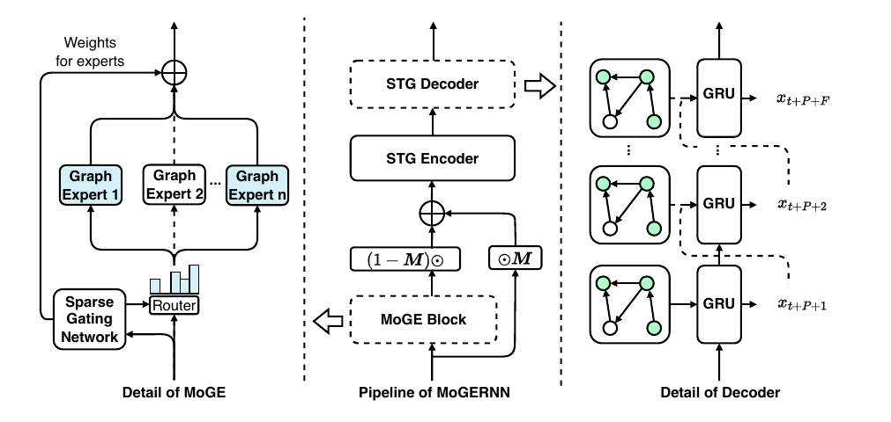
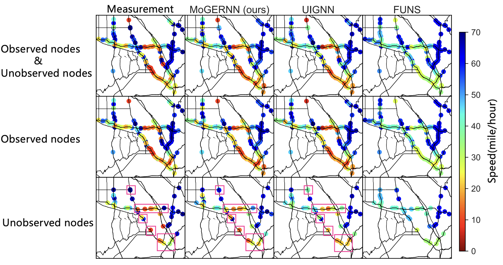

# MoGERNN
The repo is the official implementation for the paper: MoGERNN: An Inductive Traffic Predictor for Unobserved Locations.

## Introduction

Given a partially observed road network, how can we predict the traffic state of interested unobserved locations? 

Traffic prediction is crucial for advanced traffic management systems, with deep learning approaches showing exceptional performance. However, most existing approaches assume sensors are deployed at all locations of interest, which is impractical due to financial constraints. Furthermore, these methods typically require costly retraining when sensor configurations change. 

To address these challenges, we introduce MoGERNN, a novel inductive spatio-temporal graph representation model that enables accurate prediction for unobserved locations while maintaining adaptability to structural changes of sensor network. 

## Overall Architecture
MoGERNN is composed by two key modules: 1. Mixture of Graph Experts (MoGE), which is aiming for unobserved node embedding 2. Spatio-temporal Graph Encoder-Decoder (STGED), which is aiming for future state prediction for both observed nodes and unobserveds.


## Usage
1. Install the environment
```sh
conda env create --file environment.yml
```
2. Download the dataset from [Google Cloud](https://drive.google.com/file/d/1VCPGVljJzdBTfhardAiOZNimxGDXiOiw/view?usp=sharing) and put them into ./data/
3. Train the model
```sh
bash scripts/MoGERNN-train.sh
python utils/report_results.py
```
4. Test model performance in changed sensor network.
```sh
scripts/MoGERNN-test_for_new_env.sh
```
5. Reproduce based on pretrained model or checkpoints.
```sh 
bash scripts/MoGERNN-inference.sh
```
## Main Resultes

Map presentation of prediction results

## Acknowledgement
We appreciate the following GitHub repo a lot for their valuable code and efforts.
- [IGNNK](https://github.com/Kaimaoge/IGNNK)
## Contact
If you have any questions, feel free to contact:
- Qishen Zhou (qishenzhou@intl.zju.edu.cn)