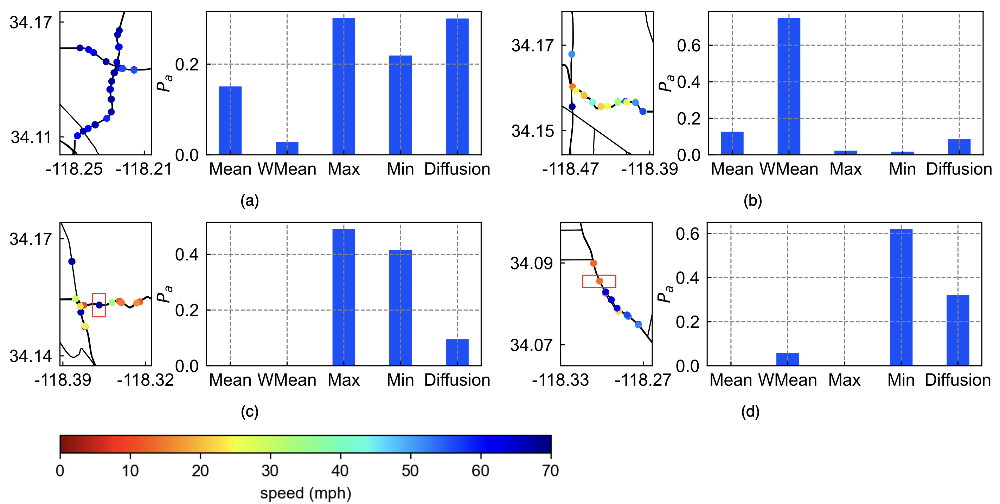

# MoGERNN
The repo is the official implementation for the paper published in Transportation Research Part C: [MoGERNN: An Inductive Traffic Predictor for Unobserved Locations](https://www.sciencedirect.com/science/article/pii/S0968090X25000841).

## Introduction

Given a partially observed road network, how can we predict the traffic state of interested unobserved locations? 

Traffic prediction is crucial for advanced traffic management systems, with deep learning approaches showing exceptional performance. However, most existing approaches assume sensors are deployed at all locations of interest, which is impractical due to financial constraints. Furthermore, these methods typically require costly retraining when sensor configurations change. 

To address these challenges, we introduce MoGERNN, a novel inductive spatio-temporal graph representation model that enables accurate prediction for unobserved locations while maintaining adaptability to structural changes in the sensor network. 

## Overall Architecture
MoGERNN is composed by two key modules: 1. Mixture of Graph Experts (MoGE), which is aiming for unobserved node embedding 2. Spatio-temporal Graph Encoder-Decoder (STGED), which aims for future state prediction for both observed nodes and unobserveds.


## Usage
1. Install the environment
```sh
conda env create --file environment.yml
```
2. Download the dataset from [Google Cloud](https://drive.google.com/file/d/1VCPGVljJzdBTfhardAiOZNimxGDXiOiw/view?usp=sharing) and put them into ./data/
3. Train the model
```sh
bash scripts/MoGERNN-train.sh
python utils/report_results.py
```
4. Test model performance in the changed sensor network.
```sh
bash scripts/MoGERNN-test_for_new_env.sh
```
5. Reproduce based on a pre-trained model or checkpoints.
```sh 
bash scripts/MoGERNN-inference.sh
```
## Main Results

Map presentation of prediction results

Visualization of graph expert contributions across multiple scenarios

## Citation
If you find this repo helpful, please cite our paper.

```
@article{MoGERNN,
  title = {{{MoGERNN}}: {{An}} Inductive Traffic Predictor for Unobserved Locations},
  author = {Zhou, Qishen and Zhang, Yifan and Makridis, Michail A. and Kouvelas, Anastasios and Wang, Yibing and Hu, Simon},
  year = {2025},
  month = may,
  journal = {Transportation Research Part C: Emerging Technologies},
  volume = {174},
  pages = {105080},
  issn = {0968090X},
  doi = {10.1016/j.trc.2025.105080}
}
```


## Acknowledgement
We appreciate the following GitHub repo for their valuable code and efforts.
- [IGNNK](https://github.com/Kaimaoge/IGNNK)

## Contact
If you have any questions, feel free to contact:
- Qishen Zhou (qishenzhou@intl.zju.edu.cn)
